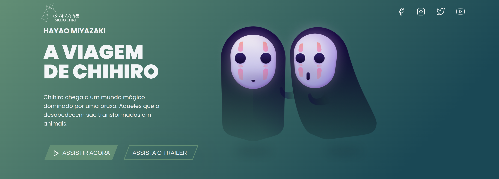

# Desafio Codelândia - 05

O dasafio consiste em criar a UI no frontend a partir do design oferecido no Figma

## Codelândia

Codelândia é uma comunidade que te ajuda a aprender mais por meio de desafios. Basicamente em um período de tempo é lançado um desafio e você faz esse desafio para aprendizado com a tecnologia que quiser. A comunidade também tem memes, materiais de estudo, networking e muito mais :)

## Tecnologias usadas no projeto

- [JavaScript](https://developer.mozilla.org/en-US/docs/Web/JavaScript)
- [CSS](https://developer.mozilla.org/en-US/docs/Web/CSS)
- [HTML](https://developer.mozilla.org/en-US/docs/Web/HTML)
- [Vite(_bundle_)](https://vitejs.dev/)

## Executando localmente

para rodar o projeto, siga os passo abaixo:

1. Clone o repositório do projeto:

   ```bash
   git clone https://github.com/Odisseu93/desafio-codelandia-05
   ```

2. navegue até a pasta raiz do projeto

   ```bash
   cd app/desafio-codelandia-05
   ```

3. Instale todas as dependencias:

   ```bash
   yarn install
   ```

4. Inicie o development server:

   ```bash
   yarn dev
   ```

## Design

**Figma: [🔗️](https://www.figma.com/file/Yb9IBH56g7T1hdIyZ3BMNO/Desafios---Codel%C3%A2ndia?node-id=5867%3A2&mode=dev)**

**Autor: [Iuri Silva](https://www.instagram.com/iuricode/)**

## Live site

# **[🔗️](https://desafio-codelandia-05.vercel.app/)**

## Screenshots

<details>
<summary>
<b>click aqui para abrir</b>
</summary>




</details>

## Desenvolvedor

<div align="center">
  
</div>
<br>
<div align="center" margin="50px">
 <a href="https://www.ulisses.tec.br" align="center">
   site
</a>
</div>
